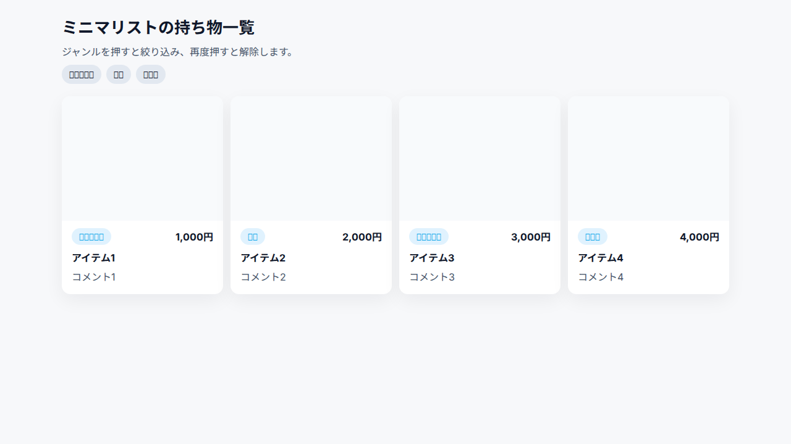

[](https://github.com/freddiefujiwara/list-of-stuff/actions/workflows/node.js.yml)

# [ミニマリストの持ち物一覧](https://freddiefujiwara.com/list-of-stuff/)

ミニマリストである筆者の持ち物を一覧にしたウェブサイトです。

## スクリーンショット



[ライブデモはこちら](https://freddiefujiwara.com/list-of-stuff/)

## 主な機能

- **持ち物一覧**: 全ての持ち物を一覧で表示します。
- **ジャンル別フィルタリング**: ジャンルを選択して、表示する持ち物を絞り込むことができます。

## 技術スタック

- [Vue.js 3](https://vuejs.org/)

## 開発

### セットアップ

```
npm install
```

### 開発サーバーの起動

```
npm run serve
```

### 本番用ビルド

```
npm run build
```

### Linterの実行

```
npm run lint
```

## 参考

- [Configuration Reference](https://cli.vuejs.org/config/)
